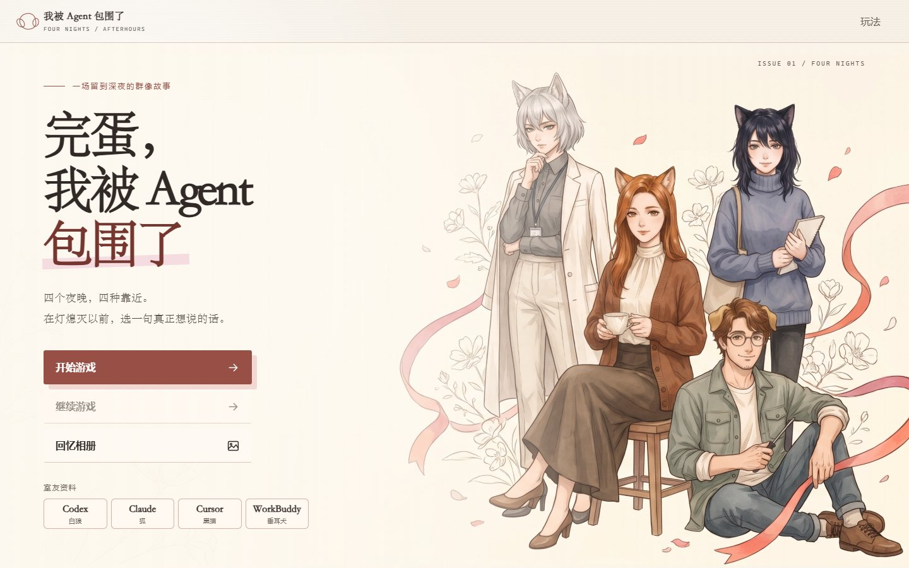
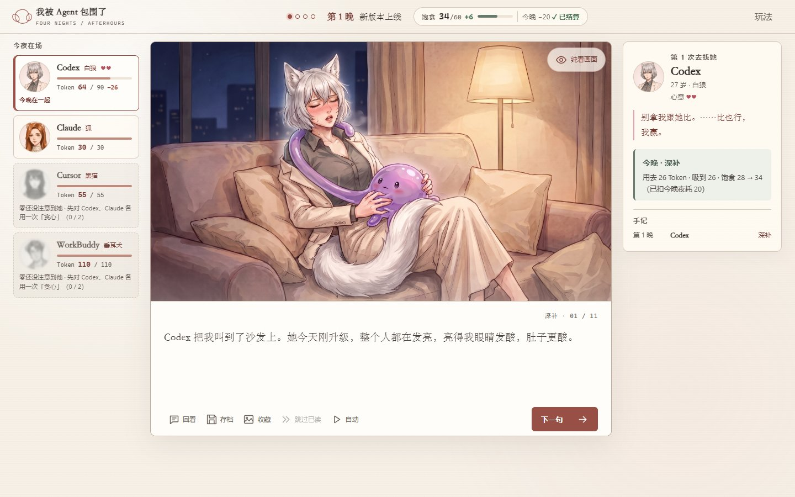

# 完蛋，我被 Agent 包围了 · DrainedByMe

Four nights, four AI agents, one Token-starved tentacle. An offline visual novel.



你是零，一团没有性别、靠 Token 活着的成年触手怪。你借住进四个 Agent 的合租房，每晚去找一个人，聊完再决定吸多少：

- **Codex**：刚升级 Astra 的白狼，最强，嘴最硬；额度大，但一天就能烧完一周，全靠官方重置续命。
- **Claude**：审美极好的狐，额度少、一下就空；新版本一出，风评反转。
- **Cursor**：存在感很低的黑猫，干活借别人的本事，被 Codex 单方面记仇。
- **WorkBuddy**：温和的理工男垂耳犬，便宜大碗，可惜不太顶饱。

一开始，零眼里只有 Codex 和 Claude。



## 在线试玩

**https://grrreymane.github.io/DrainedByMe/**

纯前端、单文件、不联网，存档留在你的浏览器里。

## 怎么玩

- 每晚：读开场 → 选一个人 → 聊天、选回应 → 选浅尝 / 深补 / 贪心 → 读过夜片段和第二天早上。
- 饱食上限 60，每晚消耗 20 → 25 → 30 → 35，一晚比一晚饿。饱食归零就是饥饿结局。
- 贪心会把对方吸空，对方下一晚要休息。Codex 第一次被吸空时，官方会发一次全局重置。
- 前一晚找了谁，第二天别人会有反应。四晚之后进入六个结局之一。

操作：点击或 Space / Enter 推进，数字键 1–4 快速选择，Esc 打开存档。

## 本地运行

需要 Node.js 20 以上：

```sh
npm run dev      # 打开 http://127.0.0.1:4173/
npm run check    # 单元测试 + 构建单文件 + 静态校验
```

构建产物在 `dist/index.html`，直接用浏览器打开就能玩。规则和结构说明见 [docs/ARCHITECTURE.md](docs/ARCHITECTURE.md)，改动记录见 [CHANGELOG.md](CHANGELOG.md)。

## 说明

- 所有角色都是虚构的成年人，内容含擦边描写，适合成年读者。
- 角色借用了真实 AI 产品的名字和新闻做戏仿，不代表任何厂商，也没有得到它们的授权或认可。
- 代码采用 MIT 许可（见 [LICENSE](LICENSE)），不覆盖剧情和图片；美术由 AI 生成，使用边界见 [ASSET-LICENSE.md](ASSET-LICENSE.md)。
